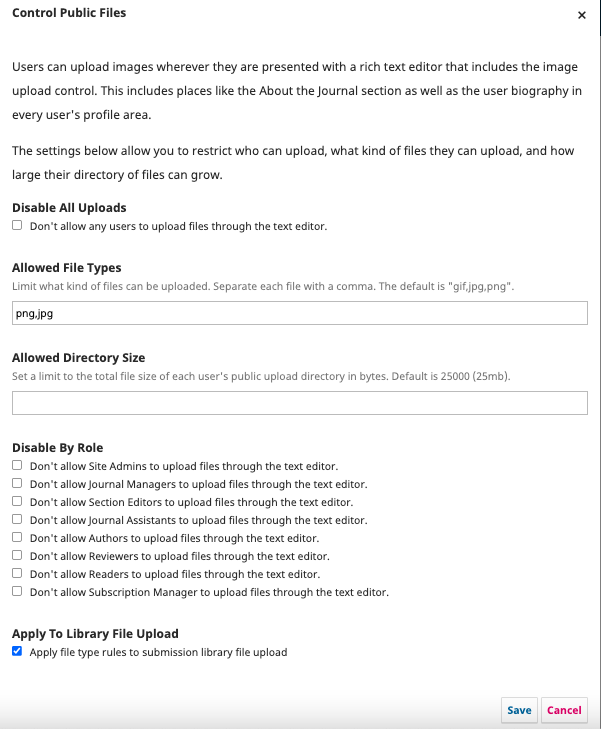

# Control Public Files Plugin

An [OJS](https://github.com/pkp/ojs) and [OMP](https://github.com/pkp/omp) plugin to limit who can upload public files and what kind of files they can upload.

Users can upload images wherever they are presented with a rich text editor that includes the image upload control. This includes places like the About the Journal section as well as the user biography in every user's profile area.

This plugin provides settings to restrict who can upload, what kind of files they can upload, and how large their directory of files can grow.

This functionality can be extended to work on the submission file library upload via the setting 'Apply To Library File Upload'.

## Installation

Use the Plugin Gallery to install this plugin from within the application.
